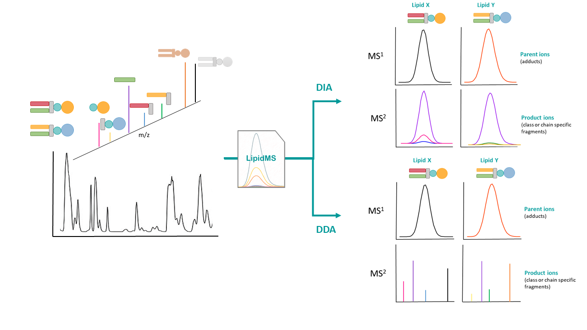
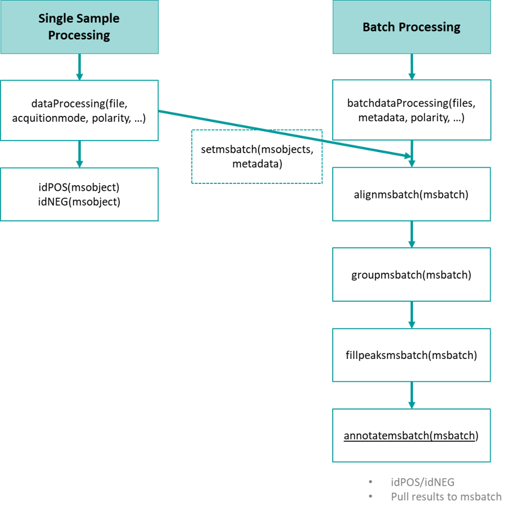

```{r, include = FALSE}
knitr::opts_chunk$set(
  collapse = TRUE,
  comment = "#>"
)
```

# LipidMS Overview

LipidMS v3 is an R-package aimed to confidently identify lipid species in untargeted LC-MS for DIA or DDA data analysis. It combines a set of fragmentation and intensity rules and a parent-to-fragment co-elution score (PFCS, only applied for DIA analysis) calculated in predefined retention time windows. Depending on the MS evidence reached by the annotations, lipids can be identified at three different levels: i) subclasslevel, e.g., PG(34:1); ii) fatty acyl level, e.g., PG(16:0_18:1); and iii) fatty acyl position level, e.g., PG(16:0/18:1). As a general rule, parent ions will be found when no collision energy is applied, while fragment ions will be found when it is. Each lipid class has characteristic ionization and fragmentation properties that allow to filter informative fragments among all fragment ions to reconstruct the parent's structure. Next figure summarizes the basis of LipidMS annotation:

{width=100%}

\break

And the following figure shows the overall workflow of LipidMS:

{width=100%}

\break

# Installation

```{r, echo=T, eval=F}
# Install LipidMS
install.packages("LipidMS", dependencies = c("Depends", "Imports"))

# load library
library(LipidMS)

```


# Files conversion

To start the MS analysis raw files need to be converted into mzXML format (you can use any software such as MSConvert from proteowizard) and then, LipidMS can be run. 


# File by file processing

First of all we will see a workflow to process and annotate samples individually 
to understand how LipidMS works and how to customize annotation rules and then, we
will see how to perform batch analysis.

## Data Processing

Once all files have been obtained, peak picking have to be performed using  the dataProcessing function from LipidMS. For further details use `help(dataProcessing, package = "LipidMS")`.

```{r, echo=T, eval=F}
# load LipidMS library
library(LipidMS)

# Example data files can be downloaded from:
# https://drive.google.com/drive/folders/1hSYrQBkh-rAA-oiaKqGkrNL7uWQraV75?usp=sharing

# get mzXML files from your working directory
files <- dir()[grepl(".mzXML", dir())]

# set the processing parameters
acquisitionmode <- c("DIA", "DDA", "MS", "MS", "MS", "DIA")
polarity <- "negative"
dmzagglom <- 15
drtagglom <- 500
drtclust <- c(100, 200)
minpeak <- c(5, 4)
drtgap <- 5
drtminpeak <- 15
drtmaxpeak <- c(100, 200)
recurs <- c(5, 10)
sb <- c(3, 2)
sn <- c(3, 2)
minint <- c(500, 100)
weight <- c(2, 3)
dmzIso <- 5
drtIso <- 5

# for single file processing, only samples acquired in DIA or DDA will be processed
files <- files[acquisitionmode %in% c("DIA", "DDA")]
acquisitionmode <- acquisitionmode[acquisitionmode %in% c("DIA", "DDA")]

# run the dataProcessing function to obtain the requires msobjects
msobjects <- list()

for (f in 1:length(files)){
  msobjects[[f]] <- dataProcessing(file = files[f],
                                   polarity = polarity,
                                   dmzagglom = dmzagglom,
                                   drtagglom = drtagglom,
                                   drtclust = drtclust,
                                   minpeak = minpeak,
                                   drtgap = drtgap,
                                   drtminpeak = drtminpeak,
                                   drtmaxpeak = drtmaxpeak,
                                   recurs = recurs,
                                   sb = sb,
                                   sn = sn,
                                   minint = minint,
                                   weight = weight,
                                   dmzIso = dmzIso,
                                   drtIso = drtIso)
}
```

This function will return a list of msobjects which will contain raw data and peaklists for each file.

## Lipid Annotation

LipidMS contains a total of 46 functions aimed to annotate lipid species: 43 class and polarity-specific functions (i.e. idPGneg) and tree general functions (idPOS, idNEG and annotatemsbatch) for ESI+, ESI+ and batch processing, respectively. Class-specific functions allow to customize fragmentation rules, while general identification functions execute all functions for a given polarity sequentially using the predefined rules.

### General annotation functions

If predefined fragmentation rules are convenient for your analysis, the easiest way to run the annotation step for individual samples is to use idPOS or idNEG for ESI+ or ESI- data, respectively. These two functions will run all class-specific functions for the given polarity. The output will be an annotated msobject with two data frames: the results table, which contains information for each annotated lipid, and the annotatedPeaklist table, which links the original MS1 data and the results table, and provides information for each feature. These functions also return the details of the fragments used for annotation.

```{r, echo=T, eval=F}
# set annotation parameters
dmzprecursor <- 5
dmzproducts <- 10
rttol <- 5
coelcutoff <- 0.8

# Annotate lipids
## If polarity is positive
if (polarity == "positive"){
  for (m in 1:length(msobjects)){
    msobjects[[m]] <- idPOS(msobjects[[m]],
                            ppm_precursor = dmzprecursor,
                            ppm_products = dmzproducts,
                            rttol = rttol,
                            coelCutoff = coelcutoff)
  }
}

## If polarity is negative
if (polarity == "negative"){
  for (m in 1:length(msobjects)){
    msobjects[[m]] <- idNEG(msobjects[[m]],
                            ppm_precursor = dmzprecursor,
                            ppm_products = dmzproducts,
                            rttol = rttol,
                            coelCutoff = coelcutoff)
  }
}

```

Then, you can use `msobjects[[1]]$annotation$results` and  `msobject[[1]]$annotation$annotatedPeaklist`  to see the results. Detailed information about the fragments supporting each lipid id can also be found at `msobjects[[1]]$annotation$detailsAnnotation`.


### Class-specific annotation functions

A more customizable option is to use the class-specific functions for lipid identification. These functions allow you to change fragmentation and intensity rules. For further information see the documentation page for each function.

```{r, echo=T, eval=F}
# example code for idPEpos function
pe <- idPEpos(msobject, 
          ppm_precursor = ppm_precursor, 
          ppm_products = ppm_products, rttol = 6, 
          chainfrags_sn1 = c("mg_M+H-H2O", "lysope_M+H-H2O"), 
          chainfrags_sn2 = c("fa_M+H-H2O", "mg_M+H-H2O"),
          intrules = c("mg_sn1/mg_sn2", "lysope_sn1/lysope_sn2"), 
          rates = c("3/1", "3/1"), intrequired = c(T),
          dbs = dbs, coelCutoff = 0.8)

# additional information about how to change rules is given in the documentation 
# of the following functions: chainFrags , checkClass, checkIntensityRules, 
# coelutingFrags, ddaFrags, combineChains and organizeResults. These functions 
# could be also empoyed to build customized identification functions.
```


## Plot your results

Once you have obtained your results, you can visualize the results with the plotLipids function. It will plot informative peaks for each lipid annotated using idPOS and idNEG (or similar functions). Plots on the left side represent raw values while plots on the left side are smoothed or clean scans (MS2 in DDA).

```{r, echo=T, eval=F}
msobject <- idPOS(msobject)
msobject <- plotLipids(msobject)

# display the first plot
msobject$plots[[1]]
msobject$plots[["yourpeakIDofinterest"]]

# save all plot to a pdf file
pdf("plotresults.pdf")
for (p in 1:length(msobject$plots)){
    print(msobject$plots[[p]])
  }
dev.off()
```


# Batch processing

In case you prefer to perform a batch analysis, you will need to build an msbatch. There are 2 different options: create an msbatch from the msobjects list obtained with `dataProcessing` followed by the `setmsbatch` function, or process your files directly with `batchdataProcessing`. This last choice will require a metadata data frame or a csv file with 3 columns: sample (mzXML file names), acquisitionmode (MS, DIA or DDA) and sampletype (QC, group1, group2, etc.)

```{r, echo=T, eval=F}
# load LipidMS library
library(LipidMS)

# Example data files can be downloaded from:
# https://drive.google.com/drive/folders/1hSYrQBkh-rAA-oiaKqGkrNL7uWQraV75?usp=sharing

# csv file with 3 columns: sample (mzXML file names), acquisitionmode 
# (MS, DIA or DDA) and sampletype (QC, group1, group2, etc.)
metadata <- read.csv("Matadata.csv", sep=",", dec = ".") 

#==============================================================================#
# Set processing parameters
#==============================================================================#

###################
# Peak-picking
polarity <- "positive" # 6550 abrir hasta 50 ppm, con el orbi dejar en 15-20 ppm
dmzagglom <- 15
drtagglom <- 500
drtclust <- c(100, 200)
minpeak <- c(8, 5)
drtgap <- 5
drtminpeak <- 15
drtmaxpeak <- 200
recurs <- c(5, 10)
sb <- c(3,2)
sn <- c(3,2)
minint <- c(5000, 1000)
weight <- c(2, 3)
dmzIso <- 5
drtIso <- 5

#==============================================================================#
# Processing
#==============================================================================#

###################
# Peak-picking
msbatch <- batchdataProcessing(metadata = metadata,
                               polarity = polarity,
                               dmzagglom = dmzagglom,
                               drtagglom = drtagglom,
                               drtclust = drtclust,
                               minpeak = minpeak,
                               drtgap = drtgap,
                               drtminpeak = drtminpeak,
                               drtmaxpeak = drtmaxpeak,
                               recurs = recurs,
                               sb = sb,
                               sn = sn,
                               minint = minint,
                               weight = weight,
                               dmzIso = dmzIso,
                               drtIso = drtIso,
                               parallel = parallel,
                               ncores = ncores)

save(msbatch, file="msbatch.rda.gz", compress = TRUE)
```

Once we have built the msbatch, we need to align samples (optional but recommended), group features and fill missing peaks to be able to get the final feature matrix.

```{r, echo=T, eval=F}
#==============================================================================#
# Set parameters
#==============================================================================#

###################
# Batch processing
dmzalign <- 5
drtalign <- 30
span <- 0.4
minsamplesfracalign <- 0.75
dmzgroup <- 5
drtagglomgroup <- 30
drtgroup <- 15
minsamplesfracgroup <- 0.25
parallel <- TRUE
ncores <- 2

#==============================================================================#
# Processing
#==============================================================================#

###################
# Alignment
msbatch <- alignmsbatch(msbatch, dmz = dmzalign, drt = drtalign, span = span, 
                        minsamplesfrac = minsamplesfracalign, 
                        parallel = parallel, ncores = ncores)

# rt deviation plot
rtdevplot(msbatch)
rtdevplot(msbatch, colorbygroup = FALSE)

# tic plot
plotticmsbatch(msbatch)
plotticmsbatch(msbatch, colorbygroup = FALSE)

###################
# Grouping
msbatch <- groupmsbatch(msbatch, dmz = dmzgroup, drtagglom = drtagglomgroup,
                        drt = drtgroup, minsamplesfrac = minsamplesfracgroup, 
                        parallel = parallel, ncores = ncores)


#####################
# Fill missing peaks
msbatch <- fillpeaksmsbatch(msbatch)


# Now we have a data matrix with all samples and features.
View(msbatch$features)
```

Now we can annotate lipids based on those samples which have been acquired in DIA or DDA mode.

```{r, echo=T, eval=F}
#==============================================================================#
# Lipid annotation
#==============================================================================#

###################
# Lipid Annotation
msbatch <- annotatemsbatch(msbatch)


# Make plots for identified lipids
for (m in 1:length(msbatch$msobjects)){
  if (msbatch$msobjects[[m]]$metaData$generalMetadata$acquisitionmode %in% c("DIA", "DDA")){
    msbatch$msobjects[[m]] <- plotLipids(msbatch$msobjects[[m]])
  }
}

print(msbatch$msobjects[[1]]$annotation$plots[[1]])

```

Finally we can write all the results in different files:

```{r, echo=T, eval=F}
###################
# features
peaklist <- msbatch$features
peaklistNoIso <- peaklist[peaklist$isotope %in% c("", "[M+0]"),]

View(peaklistNoIso)

write.csv(peaklist, file="peaklist.csv")
write.csv(peaklistNoIso, file="peaklistNoIso.csv")

###################
# annotations

# results
for (i in 1:length(msbatch$msobjects)){
  if (msbatch$msobjects[[i]]$metaData$generalMetadata$acquisitionmode %in% c("DIA", "DDA")){
    fileName <- gsub(".mzXML", "_summaryResults.csv" , 
                     msbatch$msobjects[[i]]$metaData$generalMetadata$file[i])
    write.csv(msbatch$msobjects[[i]]$annotation$results, fileName, row.names = FALSE)
  }
}

# Annotated Peaklists
for (i in 1:length(msbatch$msobjects)){
  if (msbatch$msobjects[[i]]$metaData$generalMetadata$acquisitionmode %in% c("DIA", "DDA")){
    fileName <- gsub(".mzXML", "_annotatedPeaklist.csv" , 
                     msbatch$msobjects[[i]]$metaData$generalMetadata$file[i])
    write.csv(msbatch$msobjects[[i]]$annotation$annotatedPeaklist, fileName, row.names = FALSE)
  }
}

###################
# plots

pdf("RTdevplot.pdf")
rtdevplot(msbatch)
rtdevplot(msbatch, colorbygroup = FALSE)
dev.off()

pdf("TIC.pdf", height = 7, width = 10)
plotticmsbatch(msbatch)
plotticmsbatch(msbatch, colorbygroup = FALSE)
dev.off()

# lipid id plots
for (s in 1:length(msbatch$msobjects)){
  if (msbatch$msobjects[[s]]$metaData$generalMetadata$acquisitionmode %in% c("DIA", "DDA")){
    print(s)
    if (msbatch$msobjects[[s]]$metaData$generalMetadata$acquisitionmode == "DIA"){
      height <- 7
    } else {
      height <- 9
    }
    pdf(file = gsub(".mzXML", "_plots.pdf", msbatch$msobjects[[s]]$metaData$generalMetadata$file), 
        width = 8, height = height)
    for ( pl in 1:length(msbatch$msobjects[[s]]$annotation$plots)){
      print(msbatch$msobjects[[s]]$annotation$plots[[pl]])
    }
    dev.off()
  }
}
```


# LipidMSapp

LipidMS also includes an easy-to-use shiny app which aims to be more user-friendly. It allows to customize all processing and annotation parameters and download the results once your job is completed. Results will be downloaded in .zip files.

```{r, echo=T, eval=F}
# To run LipidMS shiny app execute:
LipidMSapp()
```


# Highly customizable annotation functions of LipidMS

### Data bases

By default, LipidMS data bases (for each lipid class), are based on the combination of the following chain building blocks: 30 fatty acyl chains and 4 sphingoid bases, which were selected based on their biological relevance. If you want to add or remove any of the building blocks, `createLipidDB` function can be employed to rebuild the data bases of interest.

```{r, echo=T, eval=F}
fas <- c("8:0", "10:0", "12:0", "14:0", "14:1", "15:0", "16:0", "16:1",
"17:0", "18:0", "18:1", "18:2", "18:3", "18:4", "20:0", "20:1", "20:2",
"20:3", "20:4", "20:5", "22:0", "22:1", "22:2", "22:3", "22:4", "22:5",
"22:6", "24:0", "24:1", "26:0")
sph <- c("16:0", "16:1", "18:0", "18:1")
dbs <- createLipidDB(lipid = "all", chains = fas, chains2 = sph)

# to use for identification function two additional data frames need to be added
dbs$adductsTable <- LipidMS::adductsTable
dbs$nlsphdb <- LipidMS::nlsphdb
```

If just some DB need to be modified, you can use the following code:


```{r, echo=T, eval=F}
fas <- c("8:0", "10:0", "12:0", "14:0", "14:1", "15:0", "16:0", "16:1",
         "17:0", "18:0", "18:1", "18:2", "18:3", "18:4", "19:0", "20:0", "20:1",
         "20:2", "20:3", "20:4", "20:5", "22:0", "22:1", "22:2", "22:3", "22:4",
         "22:5", "22:6", "24:0", "24:1", "26:0")
newfadb <- createLipidDB(lipid = "FA", chains = fas)
dbs <- assignDB() # This function loads all DBs required
dbs$fadb <- newfadb$fadb # Then, you can modify some of these DBs
```


### Adducts

LipidMS uses specific adducts for each lipid class and polarity. All the adducts searched must be included in the `adductsTable` data frame that is within the package data. In case you want to use an adduct that is not included, you will need to add it:

```{r, echo=T, eval=F}
adductsTable <- LipidMS::adductsTable
adductsTable <- data.frame(adduct = c(adductsTable$adduct, "M+X"), 
                          mdiff = c(adductsTable$mdiff, 52.65), 
                          charge = c(adductsTable$charge, 1), 
                          n = c(adductsTable$n, 1),
                          stringsAsFactors = F)
```

Once included, this adduct can be used when calling the identification function:

```{r, echo=T, eval=F}
# The new adductsTable has to be also uploaded in the dbs list.
dbs <- assignDB()
dbs$adductsTable <- adductsTable

idPCpos(msobject = LipidMSdata2::msobjectDIApos, 
        adducts = c("M+H", "M+Na", "M+X"), dbs = dbs)
```


### Fragmentation and intensity rules

For a higher customization of LipidMS rules, different arguments of the identification functions can be modified:

* `clfrags`, `clrequired` and `ftype` are employed by `checkClass` function to confirm a given lipid class. This function allows three different types of fragments: fragments with a specific m/z as for example 227.0326 for PG in negative mode, which needs to be defined as clfrags = c(227.0326) and ftype = c("F"); neutral losses such as the head group of some PL (i.e. NL of 74.0359 in PG in negative mode), which will be defined as clfrags = c(74.0359) and ftype = c("NL"); or building blocks resulting from the loss of some groups, as for example, PA as M-H resulting from the loss of the head group (glycerol) in PG in ESI-, which will be defined as clfrags = c("pa_M-H") and ftype = c("BB"). The last two options could define the same fragments. In this case just one of them would be necessary. When using the third type of fragment ("BB"), the building block will be specified in lower case (i.e. pa, dg, lysopa, mg, etc.) and the adduct will be given as it appears in the adductsTable, both separated by "_". Names for the building blocks are the ones used for the LipidMS databases without the "db" at the end. In case the presence of a fragment indicates that the candidate does not belong to the lipid class (i.e. loss of CH3 in PE, which corresponds to a PC actually), this will be specified by using clrequisites = c("excluding").

* `chainfrags` argument are employed by `chainFrags` function to look for specific fragments that inform about the chains of a given class.  For example, in the case of PG subclass, the chain in sn1 position is identified by the LPG as M-H resulting from the loss of the FA chain of sn2; and the chain in sn2 position is identified as the free FA chain as M-H. These two fragments need to be searched in two different steps: in the fist step we will look for LPG coeluting with the precursor using chainfrags = c("lysopg_M-H"); then, we will look for FA chains using chainfrags = c("fa_M-H"). This information can be combined later using combineChains function. To indicate the fragments to be searched, the class of lipid is writen using the same names as the LipidMS databases without the "db" at the end (i.e. pa, dg, lysopa, mg, CE, etc.), and the adduct has to be indicated as it appears in the adductsTable, both parts separated by "_". In case some chain needs to be searched based on a neutral loss, this can be defined using "NL-" prefix, followed by the database and the adduct. If this neutral loss is employed to find the remaining chain, "cbdiff-" prefix allows to calculate the difference in carbons and doubles bounds between the precursor and the building block found. For example, "cbdiff-dg_M+H-H2O" will look for DG as M+H-H2O and then, it will return the difference between their number of carbons and double bounds and the ones from the precursor. On the other hand, "NL-mg_M+H-H2O" will look for fragments coming from the loss of MGs. In case these fragments identified as losses from the precursors are going to be employed for the intensity rules, this same prefix has to be added. If a chain is calculated based on the difference of total number of carbons and double bounds between the precursor and a previously searched chain, chainfrags argument must be must be a character vector c("") and the candidates data frame and the chain fragments list must be provided.

* `intrules`, `rates` and `intrequired` arguments are used by `checkIntensityRules` function to confirm chain structure and position. Taking PG subclass as an example, intensities of lysoPG fragments (informative for sn1) can be employed to confirm the chains structure (intrules = c("lysopg_sn1/lysopg_sn2")). In this case, the intensity of the lysoPG resulting from the loss of the FA chain in sn2 is at least 3 times greater (rates = c("3/1")) than the lysoPG resulting from the loss of the FA chain in sn1. For the intrules argument, "/" will be use to separate the fragments related to each chain (i.e. 16:0/18:1), and "_" will be use to indicate the list in which they (sn1 or sn2) will be searched. This will depend on the chain fragments rules defined previously. If you only search for LPG in chainfrags_sn1 but you want to compare in both positions, you need to use "_sn1" in both cases. For classes with more than one FA chain, if some intensity rule should be employed to identify their position but they are no defined yet, use "Unknown". If it is not necessary because the fragmentation rules are informative enough to define the position (i.e. sphingolipid species), just leave an empty vector.


If you have any further questions, please do not hesitate to contact us at: maribel_alcoriza@iislafe.es or maribel_alcoriza@hotmail.com

